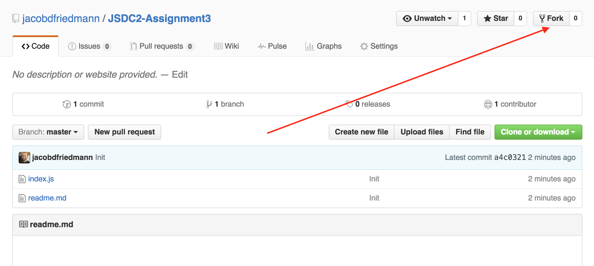
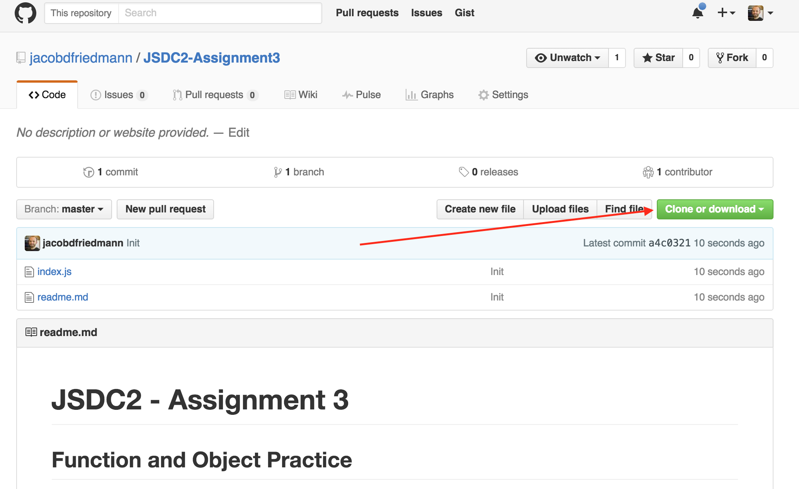
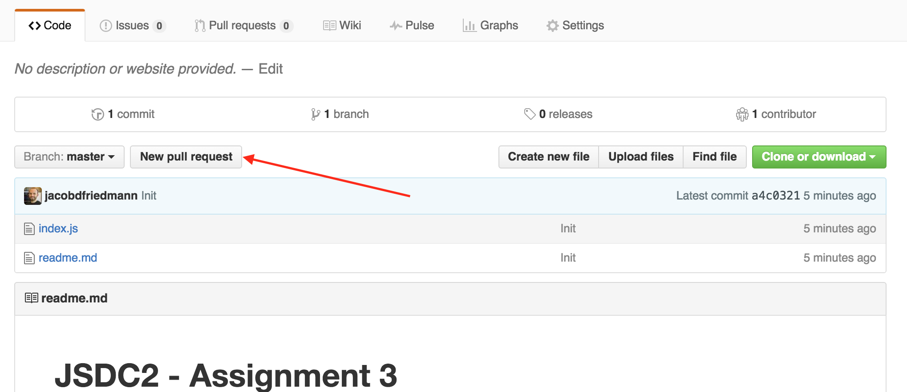
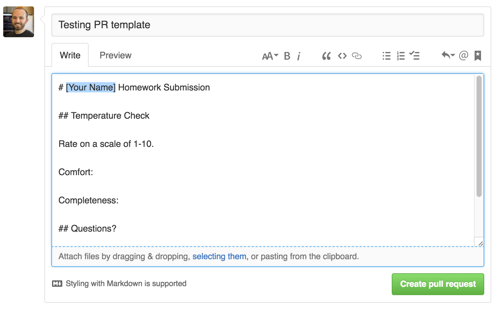

# JSDC2 - Assignment 3

## Function and Object Practice

### Instructions

Complete the questions contained in index.js.

### Reading

- [Chapter 4, Objects and Arrays, Eloquent JS](http://eloquentjavascript.net/04_data.html)
- [Chapter 5, Higher-order Functions](http://eloquentjavascript.net/05_higher_order.html)

### Due

Monday, July 4, 2016

### Submission

- Fork the GitHub Repository

- Clone your new Fork

- Write some code!

- `git add .` your changes

- `git commit` your changes, leave a commit message

- `git push` your changes back to your fork

- Submit a pull request from your fork to the upstream project, be sure to fill out the PR message

